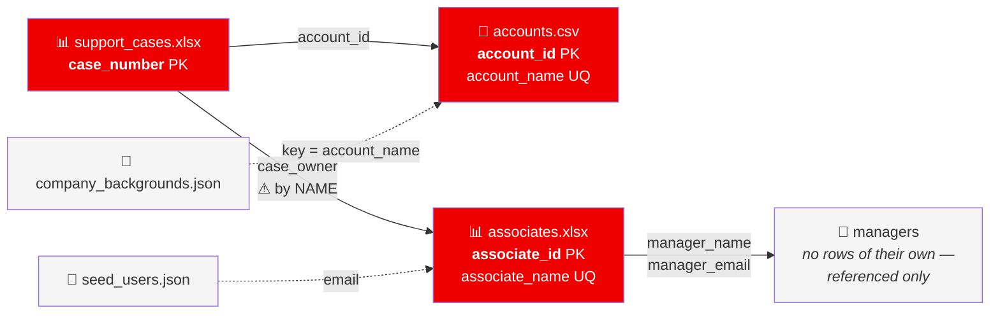

# Source Data Format

**Red Hat Support Operations Platform — Capstone #2**
How to bring your own data, what every column means, and how to load it.

---

> 🔒 **No source data ships with this repository.** The dataset this platform
> was built against is Red Hat customer and employee information — account
> names, annual revenues, contract dates, engineer names and email addresses,
> and free-text case descriptions. `data/` is in `.gitignore` and has never
> been committed. You clone the application; you supply the data.

You have three ways to get a running system. All three end at the same place —
a populated `data/` directory and one `setup_database2.py` run.

| | What you get | Effort |
|---|---|---|
| **1. Use the demo set** | 30 accounts · 25 engineers under 5 managers · 250 cases, entirely invented, committed to this repo in `demo_data/` | one `cp` |
| **2. Generate a bigger demo set** | same shapes, your chosen size | edit `tools/make_demo_data.py`, rerun |
| **3. Bring your own** | your real data | build three files to the spec below |

```bash
# Route 1 — the fastest path to a working app
mkdir -p data
cp demo_data/accounts.csv demo_data/support_cases.xlsx \
   demo_data/associates.xlsx demo_data/company_backgrounds.json data/
python setup_database2.py --from-source
```

That prints a row count per table and seeds two logins. Then `streamlit run
app1.py`. Nothing else is required.

---

## Contents

- [The five files](#the-five-files)
- [1 · accounts.csv](#1--accountscsv)
- [2 · associates.xlsx](#2--associatesxlsx)
- [3 · support_cases.xlsx](#3--support_casesxlsx)
- [4 · company_backgrounds.json *(optional)*](#4--company_backgroundsjson-optional)
- [5 · seed_users.json *(optional)*](#5--seed_usersjson-optional)
- [Controlled vocabularies — the strings that must match exactly](#controlled-vocabularies--the-strings-that-must-match-exactly)
- [How the files join](#how-the-files-join)
- [Loading the data](#loading-the-data)
- [Validating before you load](#validating-before-you-load)
- [Troubleshooting](#troubleshooting)

---

## The five files

Everything goes in `data/`, at the repository root.

| File | Format | Required | What it is |
|---|---|---|---|
| `accounts.csv` | CSV, UTF-8, header row | ✅ | One row per customer account |
| `associates.xlsx` | Excel, first sheet, header row | ✅ | One row per support engineer. Managers are referenced, not listed |
| `support_cases.xlsx` | Excel, first sheet, header row | ✅ | One row per support case |
| `company_backgrounds.json` | JSON object | ⬜ optional | HQ city + one-line blurb per account |
| `seed_users.json` | JSON array | ⬜ optional | Which two people get seeded logins |

**Column names are normalised on load** — `df.columns.str.strip().str.lower().str.replace(" ", "_")`.
So `Account ID`, `account id` and `account_id` all arrive as `account_id`. Case
and spacing in your headers do not matter; spelling does.

**Extra columns are carried through.** `to_sql(..., if_exists="append")` writes
whatever it is given, so an unexpected column will either land in the table or
raise a database error, depending on your backend. Remove columns you do not
need.

---

## 1 · accounts.csv

CSV, UTF-8, one header row, one row per account.

| Column | Type | Null? | Meaning | Notes |
|---|---|---|---|---|
| `account_id` | text | ❌ | Primary key | Any stable string. The convention is `ACC-0001`; nothing enforces it |
| `account_name` | text | ❌ | Display name | Must be **unique** — used as the join key for `company_backgrounds.json` and shown everywhere |
| `sector` | text | ❌ | Industry | Free text, but drives a filter and a colour grouping — keep the set small and consistent |
| `account_notes` | text | ✅ | Free-text account context | Shown in Customer Intelligence. Leave blank rather than inventing |
| `annual_revenue` | integer | ❌ | Contract value in USD | Bucketed into `revenue_segment` on load — see below |
| `contract_start_date` | date | ✅ | `YYYY-MM-DD` | Parsed with `errors="coerce"`; an unparseable value becomes `NULL`, not an error |
| `contract_end_date` | date | ✅ | `YYYY-MM-DD` | Drives the *renewal window* signal on the account card |
| `support_tier` | text | ❌ | Contract level | **Controlled vocabulary** — see below. A value outside it scores 0 in the priority model |
| `tam_assigned` | text | ✅ | Technical Account Manager | Blank is normal and handled — the UI shows "No TAM assigned" |
| `region` | text | ❌ | Geography | **Controlled vocabulary** |
| `employee_count` | integer | ✅ | Customer headcount | Context only; no calculation depends on it |
| `created_at` | timestamp | ✅ | Record creation | Not used by any dashboard; keep it for lineage |

**Derived on load — do not supply:** `revenue_segment`, `hq_location`,
`company_background`.

`revenue_segment` is bucketed from `annual_revenue` by `revenue_bucket()`:

| `annual_revenue` | `revenue_segment` |
|---|---|
| null | `Unknown` |
| < 1,000,000 | `< $1M` |
| < 5,000,000 | `$1M - $5M` |
| < 10,000,000 | `$5M - $10M` |
| < 25,000,000 | `$10M - $25M` |
| < 50,000,000 | `$25M - $50M` |
| ≥ 50,000,000 | `> $50M` |

**Example — two real rows from `demo_data/accounts.csv`:**

```csv
account_id,account_name,sector,account_notes,annual_revenue,contract_start_date,contract_end_date,support_tier,tam_assigned,region,employee_count,created_at
ACC-0001,Northwind Defence Systems,Aerospace & Defense,Migration programme in progress across several business units.,87645000,2024-01-20,2027-01-19,Premium,,NASA,9200,2026-03-22 00:00:00
ACC-0002,Aerolith Propulsion,Aerospace & Defense,Renewal conversation scheduled with the account team.,66202000,2023-10-05,2026-10-04,Premium,Yuki Okafor,EMEA,218400,2025-05-20 00:00:00
```

Note `ACC-0001` has an empty `tam_assigned`. That is deliberate — roughly 45%
of the demo accounts have none, so you can see the empty-state handling.

---

## 2 · associates.xlsx

Excel, first sheet, one header row, one row per support engineer.

| Column | Type | Null? | Meaning | Notes |
|---|---|---|---|---|
| `associate_id` | text | ❌ | Primary key | Convention `EMP-0001` |
| `associate_name` | text | ❌ | Full name | **This is the join key to `support_cases.case_owner`** — it must match character for character |
| `email` | text | ❌ | Work address | Must end `@redhat.com` or the person cannot register — see [Registration](#the-registration-gate) |
| `sbr` | text | ❌ | Specialist Business Rule / team | **Controlled vocabulary** |
| `shift` | text | ❌ | Historical shift pattern | ⚠️ This is *not* a rota. See the warning below |
| `skill_level` | text | ❌ | Seniority | **Controlled vocabulary** |
| `hire_date` | date | ✅ | `YYYY-MM-DD` | Drives tenure in the Team Readiness view |
| `certifications` | text | ✅ | Comma-separated list | Mined for skills — `RHCE`, `RHCSA`, `CKA`, `CKAD`, `Ansible`, `OpenShift`, `AWS`, `Azure`, `GCP` are recognised and add +3 to the matching skill |
| `active` | integer | ❌ | `1` or `0` | |
| `manager_name` | text | ❌ | Their manager's full name | Managers are **not** rows in this file — see the warning below |
| `manager_email` | text | ❌ | Their manager's address | Must agree with `manager_name`, and must **not** also appear in the `email` column |

> ⚠️ **`shift` is a historical pattern, never an availability signal.**
> The dataset records which shift someone has worked, not whether they are at
> their desk right now. The platform therefore labels this column *"shift on
> record"* and calls the people it surfaces **Potential SMEs**, never
> "Available Engineers". If you add a real rota, that is a new column and a new
> feature — do not overload this one, because an engineer woken at 3am by a
> wrong label is a real cost.

**Derived on load — do not supply:** the entire `skills` table. The loader mines
each engineer's closed-case text, their `sbr` and their `certifications`, and
writes their top 5 skills with a relevance score.

> ⚠️ **Managers are a separate population. Do not give them a row here.**
> A manager is referenced by `manager_name` and `manager_email` and appears
> nowhere else in the file. This is not a stylistic choice — `_lookup_in_data()`
> resolves a manager by searching `manager_email`, and if the same address also
> turns up in the `email` column it treats that as a role conflict and returns
> `None`. The person then cannot register at all, as either role, with a
> message that points at neither cause. The 25 demo engineers report to 5
> managers who have no rows of their own, matching the real extract's shape.

**Example row:**

| Column | Value |
|---|---|
| `associate_id` | `EMP-0001` |
| `associate_name` | `Theo Krishnan` |
| `email` | `theo.krishnan@redhat.com` |
| `sbr` | `RHOAI` |
| `shift` | `NASA` |
| `skill_level` | `Senior` |
| `hire_date` | `2019-04-03` |
| `certifications` | `OpenShift Administrator, Ansible Automation` |
| `active` | `1` |
| `manager_name` | `Adaeze Nwachukwu` |
| `manager_email` | `adaeze.nwachukwu@redhat.com` |

Adaeze Nwachukwu has no `associate_id` and no row of their own — they exist
only as a manager reference, exactly as above.

---

## 3 · support_cases.xlsx

Excel, first sheet, one header row, one row per case. This is the file
everything else revolves around.

| Column | Type | Null? | Meaning | Notes |
|---|---|---|---|---|
| `case_number` | integer | ❌ | Primary key | Unique. The in-app importer refuses duplicates |
| `account_id` | text | ❌ | FK → `accounts.account_id` | An unmatched value silently loses the account context — tier, region, TAM |
| `account_name` | text | ❌ | Denormalised copy | Kept so case views need no join. Must agree with `account_id` |
| `creation_date` | datetime | ❌ | When the case opened | Drives **age**, and therefore the whole SLA model |
| `severity` | text | ❌ | **Controlled vocabulary** | Drives 40 of the 100 priority points and the SLA target |
| `status` | text | ❌ | **Controlled vocabulary** | Decides open vs closed, and whether the score is damped |
| `csat_score` | float | ✅ | 1–5 | Null on unresolved cases is normal and expected — 57% of the real extract is null. A null scores the neutral midpoint, never 0 |
| `sbr` | text | ❌ | Team that owns it | **Controlled vocabulary**. Whitespace is stripped on load |
| `problem_statement` | text | ❌ | Short symptom description | Grouped to find [observed historical patterns](PROJECT_HANDBOOK.md#109-observed-historical-patterns) — so repeated wording is a *feature*, not sloppiness |
| `description` | text | ✅ | Long free text | Fed to TF-IDF similarity and skill mining |
| `product_name` | text | ❌ | Red Hat product | Free text, but the skill miner keyword-matches it |
| `product_version` | float | ✅ | e.g. `8.5` | A float, not a string — `4.13` sorts numerically |
| `sovereign_support` | integer | ❌ | `1` or `0` | Data-residency flag; shown as a badge |
| `business_hours` | text | ❌ | **Controlled vocabulary** | A feature in the escalation-risk model |
| `case_owner` | text | ❌ | FK → `associates.associate_name` | **By name, not ID.** A typo here orphans the case from every team view |
| `last_updated` | datetime | ❌ | Last activity | Drives **staleness**, worth up to 15 priority points |
| `resolution_date` | datetime | ✅ | When it closed | Null for open cases. Must be ≥ `creation_date` |
| `escalated` | integer | ❌ | `1` or `0` | Worth 10 priority points and it is the label the risk model is scored against |

**Derived on load — do not supply:** `time_to_resolve_hours`, computed as
`(resolution_date − creation_date)` in hours, rounded to 2 dp, only where both
are present.

**Example row:**

| Column | Value |
|---|---|
| `case_number` | `3000000` |
| `account_id` | `ACC-0009` |
| `account_name` | `Tarnwick Power Authority` |
| `creation_date` | `2026-04-08 03:00:00` |
| `severity` | `Severity 1 (Urgent)` |
| `status` | `Closed` |
| `csat_score` | *(blank — closed without a survey response)* |
| `sbr` | `Virtualization` |
| `problem_statement` | `API gateway returning intermittent 503 responses` |
| `description` | `Customer reports API gateway returning intermittent 503 responses. Issue began after a routine change window…` |
| `product_name` | `Red Hat OpenShift Virtualization` |
| `product_version` | `7.7` |
| `sovereign_support` | `0` |
| `business_hours` | `Follow-the-Sun` |
| `case_owner` | `Priya Nilsen` |
| `last_updated` | `2026-06-01 20:00:00` |
| `resolution_date` | `2026-05-10 17:00:00` |
| `escalated` | `0` |

Note that `csat_score` is blank on a *closed* case. That is normal — customers
do not always answer the survey — and it is why a missing CSAT scores the
neutral midpoint rather than zero. Note also that `last_updated` is three weeks
after `resolution_date`: someone added a note post-closure. The derived
`time_to_resolve_hours` uses `resolution_date`, not `last_updated`, so it reads
782.0 h and is unaffected.

### Dates and the reference clock

The dashboards do **not** use `datetime.now()` as "today". `desk_reference_time()`
takes the newest timestamp across `creation_date`, `last_updated` and
`resolution_date`, then clamps it to the real clock so it can never run into
the future:

```python
min(max(newest timestamp in the data), pd.Timestamp.now())
```

A static extract therefore behaves consistently forever instead of ageing into
a wall of breached SLAs.

The consequence for your data: **ages are measured relative to your newest
row.** If your extract stops in June and you load it in December, the app
reports June as "now" and shows *"data as of 11 Jun 2026"* in the header. It is
not stale-by-accident; it is stale-and-saying-so.

---

## 4 · company_backgrounds.json *(optional)*

A flat object keyed by `account_name` — the **name**, not the ID, because this
is the field a human filling it in will have to hand.

```json
{
  "Northwind Defence Systems": [
    "Bristol, UK",
    "Defence systems integrator; long-running RHEL estate."
  ],
  "Aerolith Propulsion": [
    "Toulouse, France",
    "Aerospace propulsion manufacturer."
  ]
}
```

Each value is a two-element array: `[hq_location, company_background]`. They
populate the two columns of the same name on `accounts`.

Behaviour when things are missing, all of it deliberate and none of it fatal:

| Situation | Result |
|---|---|
| File absent | Both columns `NULL` for every account; a warning is not even printed |
| File present, account not listed | Both columns `NULL` for that account only |
| File malformed | Warning printed, treated as absent, load continues |

The Customer Intelligence view degrades gracefully — it shows the account
without the HQ line rather than failing.

---

## 5 · seed_users.json *(optional)*

Which two people get a pre-created login. A JSON array of objects:

```json
[
  {"email": "you@redhat.com",       "role": "manager",   "display_name": "Your Name"},
  {"email": "colleague@redhat.com", "role": "associate", "display_name": "Their Name"}
]
```

| Key | Required | Notes |
|---|---|---|
| `email` | ✅ | **Must exist in `associates.xlsx`**, or the registration gate contradicts the seeded account |
| `role` | ✅ | `manager` or `associate` |
| `display_name` | ✅ | Shown in the header |

> 🔐 **No password appears in this file, or in any file.** Passwords come from
> the environment at load time — `SEED_MANAGER_PASSWORD` and
> `SEED_ASSOCIATE_PASSWORD`, defaulting to the documented development values
> `manager123` / `associate123`. Set both to something real before any
> deployment another person can reach; the defaults are published in the
> handbook and are therefore public.

If the file is absent, the two demo logins are seeded instead
(`adaeze.nwachukwu@redhat.com` as manager, `theo.krishnan@redhat.com` as
associate) — the first appears only in `manager_email`, the second only in
`email`, so both pass the gate and the demo set is self-consistent out of the
box.

### The registration gate

Anyone else signs up through the app, and the gate is strict:

- the address must end `@redhat.com`
- **it must already exist in `associates.xlsx`** — you cannot register a person
  the organisation does not employ. An associate is matched on `email`; a
  manager is matched on `manager_email`
- **an address must not appear in both columns.** That is read as a role
  conflict and the registration is refused outright — the reason managers get
  no row of their own
- a manager cannot register as an associate, or the reverse; the role is checked
  against the data, not just the dropdown
- admin has no registration path at all; it is one hardcoded account driven by
  `ADMIN_PASSWORD`

So your `associates.xlsx` is also your user directory. If someone cannot log
in, that is the first file to check.

---

## Controlled vocabularies — the strings that must match exactly

These are not suggestions. Scoring weights, colour maps and SLA targets are
dictionaries keyed by these exact strings. A value outside the set does not
crash anything — it silently scores **zero** and renders grey, which is far
worse than an error because nobody notices.

**`support_cases.severity`** — the four-way split drives both the priority
weight and the SLA target:

| Value | Priority points | Default SLA target |
|---|---|---|
| `Severity 1 (Urgent)` | 40 | 24 h |
| `Severity 2 (High)` | 28 | 48 h |
| `Severity 3 (Normal)` | 16 | 120 h |
| `Severity 4 (Low)` | 8 | 240 h |

**`support_cases.status`** — six values, in three behavioural groups:

| Value | Group | Effect |
|---|---|---|
| `Open` | actionable | in the queue at full weight |
| `In Progress` | actionable | in the queue at full weight |
| `Waiting on Engineering` | actionable | in the queue at full weight — it is still your move |
| `Waiting on Customer` | waiting | in the queue, score **× 0.45** |
| `Resolved` | closed | excluded from the queue, included in history |
| `Closed` | closed | excluded from the queue, included in history |

**`accounts.support_tier`** — contributes to the priority score:

| Value | Priority points |
|---|---|
| `Premium Plus` | 10 |
| `Premium` | 7 |
| `Standard` | 3 |
| `Self-Support` | 0 |

**The rest** — matched for filters, colours and grouping:

| Column | Allowed values |
|---|---|
| `accounts.region` | `APAC`, `EMEA`, `LATAM`, `NASA` |
| `associates.shift` | `APAC`, `EMEA`, `India`, `NASA` |
| `associates.skill_level` | `Associate`, `Mid-Level`, `Senior`, `Staff`, `Principal` |
| `support_cases.business_hours` | `Business Hours`, `Follow-the-Sun` |
| `sbr` *(both files)* | `ACM`, `Ansible`, `API Management`, `Ceph`, `Identity Management`, `JBoss Middleware`, `Kernel`, `Networking`, `OCS`, `RHOAI`, `Shift`, `Shift Hosted`, `Stack`, `Storage`, `SysMgmt`, `Virtualization` |

`sector` and `product_name` are **not** controlled — they are free text. But
`product_name` is keyword-matched by the skill miner, so naming a product
`RHEL 9` instead of `Red Hat Enterprise Linux 9` still works (both contain a
recognised keyword) while naming it `Linux Box` yields no inferred skills.

---

## How the files join

Five joins. Two of them are on human names rather than IDs, and those are the
two that break.



| Join | From | To | Breaks like this |
|---|---|---|---|
| Case → Account | `support_cases.account_id` | `accounts.account_id` | Case loses tier, region and TAM. Priority drops by up to 10 points with no visible reason |
| Case → Engineer | `support_cases.case_owner` | `associates.associate_name` | Case vanishes from *My Cases* and *Team Queue*. **The most common failure** |
| Engineer → Manager | `associates.manager_name` + `manager_email` | *(a manager identity, not a row)* | Inconsistent spelling splits one manager into two, and each sees half a team |
| Account → Background | `company_backgrounds.json` key | `accounts.account_name` | HQ and blurb blank; nothing else |
| Login → Engineer | `seed_users.json` email | `associates.email` | Seeded account exists but cannot pass the registration gate |

> ⚠️ **`case_owner` and `manager_name` join on human names.** `"Theo Krishnan"`
> and `"Theo  Krishnan"` are different people as far as pandas is concerned,
> and nothing will tell you — the case simply stops appearing in anyone's
> queue. This is a weakness of the source schema rather than a design choice,
> and the [validation script](#validating-before-you-load) below exists
> specifically to catch it.

---

## Loading the data

### Bulk load — the whole dataset

`setup_database2.py` is a **one-shot build, not a migration tool**. On
PostgreSQL it drops and re-creates the five tables; on SQLite it deletes and
recreates the file. Anything a user entered through the app — case notes, desk
state — is in separate tables and survives on PostgreSQL, but a SQLite rebuild
starts from nothing.

```bash
# optional: set real seed passwords first
export SEED_MANAGER_PASSWORD='choose-something'
export SEED_ASSOCIATE_PASSWORD='choose-something-else'

python setup_database2.py --from-source
```

Expected output:

```
Connecting to PostgreSQL...
  Cleared existing tables
  Re-created schema
  accounts: 30 rows loaded
  support_cases: 250 rows loaded
  associates: 25 rows loaded
  skills: 125 rows loaded (25 associates)
  indexes: 18 created
  test users: 2 seeded (manager + associate)

  Verification:
    accounts: 30 rows
    support_cases: 250 rows
    associates: 25 rows
    skills: 125 rows
```

If `data/` is empty the script exits before touching the database:

```
ERROR: Missing source files: [PosixPath('data/accounts.csv'), ...]
```

### Incremental load — adding cases through the app

Admins get a **Data Management** panel in `app2.py` with four tabs: *CSV
Upload*, *Manual Entry*, *Delete Case*, *Export Data*. Managers and associates
do not — `data_ingest` is `False` for both roles.

The CSV importer needs **six columns only**:

```
case_number, account_name, severity, status, product_name, case_owner
```

Any other columns from the full case schema are accepted and written; the six
are the ones that must be present and non-empty. The importer then:

1. rejects the file outright if a required column is missing, naming which
2. drops rows where any required field is empty, telling you how many
3. drops rows whose `case_number` already exists, telling you how many
4. shows the surviving count and waits for you to press **Import CSV**

Nothing is written until that last click. A file that is entirely duplicates
reports *"All rows already exist in the database. Nothing to import."* rather
than silently doing nothing.

*Manual Entry* takes one case at a time from dropdowns populated by the
existing data — so you cannot invent an account or an owner that does not
exist, which closes the by-name join hole for anything entered this way. The
case number is allocated as `MAX(case_number) + 1`.

---

## Validating before you load

Run this against `data/` before the first load. It checks exactly the things
that fail silently.

```python
# tools/check_data.py  — not shipped; paste it, it is short on purpose
import pandas as pd
from pathlib import Path

D = Path("data")
acc = pd.read_csv(D / "accounts.csv")
eng = pd.read_excel(D / "associates.xlsx")
cas = pd.read_excel(D / "support_cases.xlsx")
for df in (acc, eng, cas):
    df.columns = df.columns.str.strip().str.lower().str.replace(" ", "_")

SEV = {"Severity 1 (Urgent)", "Severity 2 (High)",
       "Severity 3 (Normal)", "Severity 4 (Low)"}
STATUS = {"Open", "In Progress", "Waiting on Customer",
          "Waiting on Engineering", "Resolved", "Closed"}
TIER = {"Premium Plus", "Premium", "Standard", "Self-Support"}

def report(label, bad):
    bad = sorted(set(bad))
    print(f"{'OK  ' if not bad else 'FAIL'}  {label}"
          + (f"  →  {bad[:5]}{' …' if len(bad) > 5 else ''}" if bad else ""))

report("case.account_id not in accounts",
       set(cas.account_id) - set(acc.account_id))
report("case.case_owner not in associates",
       set(cas.case_owner) - set(eng.associate_name))
report("manager_email also in the email column (blocks registration)",
       set(eng.manager_email.str.lower()) & set(eng.email.str.lower()))
report("manager_name / manager_email disagree",
       [n for n, g in eng.groupby("manager_name")
        if g.manager_email.nunique() > 1])
report("unknown severity", set(cas.severity) - SEV)
report("unknown status", set(cas.status) - STATUS)
report("unknown support_tier", set(acc.support_tier) - TIER)
report("duplicate case_number",
       cas.case_number[cas.case_number.duplicated()])
report("duplicate account_name",
       acc.account_name[acc.account_name.duplicated()])
report("duplicate associate_name",
       eng.associate_name[eng.associate_name.duplicated()])
report("names with padding/double spaces",
       [n for n in set(eng.associate_name) | set(cas.case_owner)
        if isinstance(n, str) and (n != n.strip() or "  " in n)])
report("resolution before creation",
       cas.case_number[cas.resolution_date < cas.creation_date])
report("email not @redhat.com",
       [e for e in eng.email if not str(e).endswith("@redhat.com")])

print(f"\n{len(acc)} accounts · {len(eng)} associates · {len(cas)} cases")
newest = max(cas[c].max() for c in
             ("creation_date", "last_updated", "resolution_date"))
print(f"reference clock will be: {min(newest, pd.Timestamp.now())}")
```

Every `FAIL` above is a silent failure at runtime, not a crash. That is the
whole reason to run it.

---

## Troubleshooting

| Symptom | Cause | Fix |
|---|---|---|
| `ERROR: Missing source files: [...]` | `data/` is empty or misnamed | `cp demo_data/* data/`, or check filenames exactly |
| App starts, every view is empty | Loader never ran, or ran against a different database | Re-run `setup_database2.py`; confirm `DATABASE_URL` matches what the app reads |
| An engineer's *My Cases* is empty | `case_owner` does not match `associate_name` | Run the validator; look for padding and double spaces |
| A manager's *Team Queue* is empty | No one has that person in `manager_name` | Check the self-join |
| Every case shows priority ≈ severity only | `account_id` is not matching, so tier scores 0 | Run the validator |
| All cases grey, no severity colours | `severity` strings are outside the vocabulary | Match them exactly, brackets and all |
| SLA targets look wrong for everything | Same cause — the target is looked up by the severity string | As above |
| Header date is months in the past | Correct behaviour — the clock is your newest `last_updated` | Load fresher data, or accept it; the header says so honestly |
| Nobody can register | Their email is not in `associates.xlsx`, or is not `@redhat.com` | Add the row and reload |
| Seeded login rejected | `seed_users.json` names someone absent from `associates.xlsx` | Make the two files agree |
| HQ and background blank everywhere | `company_backgrounds.json` absent or keyed by `account_id` | Key it by `account_name` |
| `skills` table has 0 rows | No `description` text and no recognised `certifications` | Skills are mined from text; with none, there is nothing to mine |

---

## See also

- **[Project Handbook](PROJECT_HANDBOOK.md)** — architecture, every feature,
  and [Chapter 10](PROJECT_HANDBOOK.md#chapter-10--every-calculation-explained),
  which shows each formula worked through on a real row of the demo dataset
- **[Chapter 5 — The Data](PROJECT_HANDBOOK.md#chapter-5--the-data)** — the
  loader, the entity relationships and the derived columns
- **[Appendix A](PROJECT_HANDBOOK.md#appendix-a--complete-inventory-databases-tables-tools--configs)**
  — every table, column, index and config file
- **`tools/make_demo_data.py`** — the generator; read it as an executable
  specification of everything on this page
